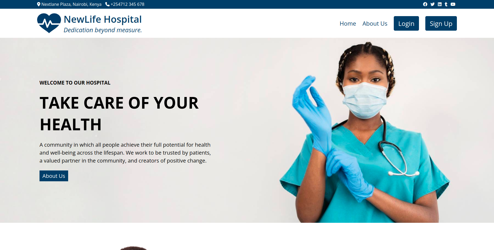

# NewLife Hospital App

#### By:

> David Ondiege, Enock Mokua, Vincent Makoha, Winston Langat, & David Njoroge

## Table of Content

- Title
- Description

## Description

NewLife Hospital is a web platform built with React and Ruby on Rails for the front-end and back-end respectively. NewLife App is a platform that assists hospital administration, patients and pactitioners to collaborate.

Patients can sign up and book different appoitments with their preferred practitioners, medical practitioners can check the updates on different appointments,
patients purchasing diffeent medical products of the hospital shop,
an admin controlling the Hospital database by performing all the CRUD operations for patients, practitioners and patients and much more.

Newlife Hospital App is an application that looks to simplify healthcare processes for both practitioners eg doctors, nurses, surgeons, nutritionists, caregivers etc and the patients themselves and in turn improve efficiency and improve time management.

## Built With

- Frontend: React JS
- Backend: Ruby on Rails (API)
- Database: PostgreSQL
- Designing: Figma
- Testing: Rspec
- Deployment: Vercel & Railway

## Features

1. A user is able to register as a patient and log in
2. A patient is able to book an appointment with a practitioner of their choice
3. A user is able to see a list of all practitioners and send messages
4. A user is able to view all and single shop products
5. A user can post, show & delete their cart data to the DB
6. A practitioner is able to log in to an existing account (created by Admin)
7. A practitioner can has access to chat messages with his patients
8. A user can log in and out as an admin
9. An Admin can see the hospital's dashboard
10. An admin can CRUD a shop product
11. An Admin can CRUD a practitioner

## Screenshot

## Deployed Work

[NewLife Hospital Frontend](https://newlife-frontend.vercel.app/) - Vercel.app
 
[NewLife Hospital Backend](https://newlife-backend-production.up.railway.app/) - Railway.app

## MVP

A user would be able to:

- A user is able to register as a patient and log in
- A patient is able to book an appointment with a practitioner of their choice
- A user is able to see a list of all practitioners and send messages
- A user is able to view all and single shop products
- A user can post, show & delete their cart data to the DB
- A practitioner is able to log in to an existing account (created by Admin)
- A practitioner can has access to chat messages with his patients
- A user can log in and out as an admin
- An admin can CRUD a shop product
- An Admin can see the hospital's dashboard
- An Admin can CRUD a practitioner
   

## Prerequisites

- An IDE of your choice (preferably Visual Studio Code)
- A web browser (preferably Chrome) to view the webpage
- Have node installed to support React.js oprations
- Have installed ruby & rails for the backend environment
- Have installed PostgreSQL

## Installation

### Front End:

- Clone the project depending on your local environment
  - SSH - `git@github.com:david-commit/newlife-frontend.git`
  - HTTPS - `https://github.com/david-commit/newlife-frontend.git`
- Run `npm install` to install all required dependancies
- Run `npm start` to start the development server

### Back End:

- Clone the project depending on your local environment
  - SSH - `git@github.com:david-commit/newlife-backend.git`
  - HTTPS - `https://github.com/david-commit/newlife-backend.git`
- Run `bundle install` to install all required dependancies
- Run `rails server` to start the backend server

### Usage

- Make sure your rails server is running for the app to work as intended.
- The project requires an internet connection to work because some information is fetched from an external source.
- Once the frontend is running, a brower tab will automatically open [http://localhost:4000](http://localhost:4000) to view the appearance on your browser.
- The page will reload when you make changes.
- You would be required to sign up and create an account before you can be granted access to the full application. You are allowed to create account as a patient and as a medical practitioner. For subsequent access, you will be required to log in.

## API Documentation

Get more infomation and guidance on how to consume the API here > [API Documentation](https://github.com/david-commit/newlife-backend/blob/development/README.md)

## Project Technologies

- React JS - Frontend (Node - v16.17.0)
- Rails (API) - Backend (Ruby - v2.7.4, Rails - v7.0.4)
- PostgreSQL - DataBase (v15)
- Figma - Design
- Tests - Rspec
- Deployment - Vercel & Railway
   

## YouTube Demo

## Contribution

This app represents the first version. In this case, it is still work in progress. In case a user encounters issues or experiences a bug, kindly feel free to reach the developer through davidondiege@gmail.com

You can also create an issue on GitHub of reach out for collaboration.

## Authors

👤 David Ondiege - [GitHub](https://github.com/david-commit)
 
👤 Vincent Makokha - [GitHub](https://github.com/VinceXIV)
 
👤 Enock Mokua - [GitHub](https://github.com/MokuaEnock)
 
👤 Winston Langat - [GitHub](https://github.com/Winston5691)
 
👤 David Njoroge - [GitHub](https://github.com/njoroge35)

## Copyright & License

Copyright (c) 2023 David Ondiege, Vincent Makokha, Enock Mokua, Winston Langat, David Njoroge

Permission is hereby granted, free of charge, to any person obtaining
a copy of this software and associated documentation files (the
"Software"), to deal in the Software without restriction, including
without limitation the rights to use, copy, modify, merge, publish,
distribute, sublicense, and/or sell copies of the Software, and to
permit persons to whom the Software is furnished to do so, subject to
the following conditions:

The above copyright notice and this permission notice shall be
included in all copies or substantial portions of the Software.

THE SOFTWARE IS PROVIDED "AS IS", WITHOUT WARRANTY OF ANY KIND,
EXPRESS OR IMPLIED, INCLUDING BUT NOT LIMITED TO THE WARRANTIES OF
MERCHANTABILITY, FITNESS FOR A PARTICULAR PURPOSE AND
NONINFRINGEMENT. IN NO EVENT SHALL THE AUTHORS OR COPYRIGHT HOLDERS BE
LIABLE FOR ANY CLAIM, DAMAGES OR OTHER LIABILITY, WHETHER IN AN ACTION
OF CONTRACT, TORT OR OTHERWISE, ARISING FROM, OUT OF OR IN CONNECTION
WITH THE SOFTWARE OR THE USE OR OTHER DEALINGS IN THE SOFTWARE.
